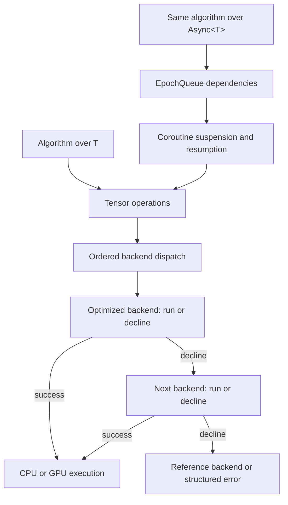

# Uni20

[](https://github.com/Uni20-dev/uni20/actions/workflows/ci.yml)
[](https://github.com/Uni20-dev/uni20/actions/workflows/docs.yml)
[](LICENSE)

**A C++23 research library for asynchronous, symmetry-aware tensor networks on
CPUs and NVIDIA GPUs.**

Uni20's target is tensor-network calculations over tensor categories
with non-trivial braiding, at the scale of large GPU clusters. That means
grappling with tensor data that is block sparse, numerical work that spans
multiple libraries and devices, and dependencies between operations too
complex to manage by hand. The current prototype validating that architecture end to end is a
U(1)-symmetric two-site DMRG calculation for the spin-half Heisenberg chain
that exercises the async runtime, ordered CPU/GPU backend dispatch, and
block-sparse tensor model together, running on multiple CPUs or a single
NVIDIA GPU.

> [!IMPORTANT]
> Uni20 is an early-stage research project, not a stable released library.
> APIs and algorithms are evolving, backend coverage is operation-specific,
> and the code currently serves as an executable design and validation
> platform rather than a general-purpose tensor-network package.

## Working Today

Uni20 already contains several connected, tested vertical slices:

- a finite open-chain spin-half Heisenberg calculation using
  symmetry-aware MPO and environments, matrix-free fixed-work Lanczos, and
  alternating two-site DMRG sweeps on CPU or a single resident CUDA device;
- a bosonic Abelian U(1) `BlockTensor` model with typed domain/codomain spaces,
  sparse and complete block patterns, packed host and CUDA storage,
  structure-preserving contraction and linear operations, and staged
  per-charge-sector SVD and truncation;
- an epoch-ordered async runtime with C++ coroutine tasks, debug and oneTBB
  schedulers, CUDA-aware suspension and scheduling, task diagnostics with
  Graphviz DAG snapshots, and async wrappers over the dense operation surface;
- ordered backend dispatch across CPU reference, BLAS, LAPACK, compiled CUDA,
  cuBLAS, and cuSOLVER implementations, with explicit runtime decline and no
  hidden host/device transfer;
- fixed-rank dense `Tensor` values with compile-time rank and runtime extents,
  generated tensors, structural views, reductions, contractions,
  decompositions, and matrix-free Krylov algorithms;
- real and complex `float`/`double` paths across the supported host and CUDA operations,
  plus binary128 via MPLAPACK;
- a presentation and diagnostics layer with selectable Unicode/emoji/ASCII
  terminal rendering, display-width-aware tables and tensor previews,
  structured kernel-dispatch failure reports, and stacktrace formatting.

## Run the DMRG Vertical Slice

A supported C++23 compiler, CMake 3.24 or newer, and BLAS/LAPACK are required.
Compatible versions of oneTBB, fmt, GoogleTest, and Google Benchmark can be
fetched by CMake when they are not installed locally.

```bash
cmake -S . -B build -G Ninja -DCMAKE_BUILD_TYPE=Release
cmake --build build --target spin_half_heisenberg_dmrg_example
./build/examples/spin_half_heisenberg_dmrg_example --check
```

The current CPU build supports real or complex `fp32`, `fp64`, and — when
built with `-DUNI20_ENABLE_MPLAPACK=ON` — real or complex `fp128`, selectable
at runtime via `--scalar=real|complex` and `--precision=fp32|fp64|fp128`.

For a CUDA build with cuBLAS and cuSOLVER:

```bash
cmake -S . -B build-cuda -G Ninja \
  -DCMAKE_BUILD_TYPE=Release \
  -DUNI20_ENABLE_CUDA=ON \
  -DUNI20_BACKEND_CUBLAS=ON \
  -DUNI20_BACKEND_CUSOLVER=ON
cmake --build build-cuda --target spin_half_heisenberg_dmrg_example
./build-cuda/examples/spin_half_heisenberg_dmrg_example \
  --execution=cuda --cuda-device=0 --check
```

The current CUDA DMRG executable supports real double precision. See the
[model example guide](examples/models/) for larger fixtures, execution and
storage controls, reference energies, and benchmarking rules.

## What Makes Uni20 Different?

The following three sections explain the design ideas that make this possible:
ordinary algorithms lift to async execution unchanged, and each backend runs or
declines independently.

### Write the algorithm once; make the values async

`Async<T>` represents a value of type `T` together with its lifetime and
read/write history. Uni20 tensor operations accept either ordinary tensors or
their asynchronous counterparts with the same names and mathematical meaning.
The intended change to an algorithm is deliberately small:

```cpp
template <class Matrix>
void product_step(Matrix& output, Matrix const& lhs, Matrix const& rhs)
{
  uni20::linalg::assign_product(output, lhs, rhs);
  uni20::linalg::add_product(output, lhs, rhs, 0.5);
}

product_step(output, lhs, rhs);                         // DenseMatrix<T>
product_step(async_output, async_lhs, async_rhs);       // Async<DenseMatrix<T>>
```

In the async version, each call schedules its operation to run asynchronously
and returns immediately. Because they write the same output, Uni20
automatically orders the update after the initial product. The caller does
not connect task handles or insert a barrier.

Internally, each `Async<T>` has an `EpochQueue` that records which operations
read and write the value. Those accesses form an implicit dependency graph:
an operation may have to wait until an earlier read or write on the same
value has finished before it can run. Blocking a worker thread on that wait
would defeat the point of scheduling in the first place, so Uni20 represents
each operation as a C++ coroutine — a resumable function that can suspend
mid-execution and be resumed later without tying up a scheduler participant
while it waits. When an operation's data, CUDA stream, or provider handle
isn't ready, it suspends there; when the dependency becomes ready, execution
resumes with the operation's state and storage still alive in the coroutine
frame.

The scheduler is therefore responsible only for running ready work; the epoch
queues are responsible for causal ordering. The same algorithm can run through
a deterministic debug scheduler, concurrently through oneTBB, or with CUDA
completion integrated into the tensor's storage timeline. This enables the
same algorithm to run in a serial configuration or on multiple
CPUs or GPUs with no changes to the algorithm.

### Let each backend run or decline

An operation can have several implementations, ordered from the most specific
or optimized to the most general, and Uni20 tries them in order until one
succeeds. Some declines are settled at compile time — a kernel simply has no
instantiation for a given combination of types — while others are run-time
decisions: an optimized contraction can decline a layout it doesn't handle, or
a provider can decline a scalar type it doesn't support, and the next
compatible backend gets its turn. A build without an optional library simply
leaves that backend out of the chain entirely. The algorithm itself contains
no backend-specific fallback tree, and individual backends never redispatch to
one another.

Declining is safe only before real computation starts — a backend may prepare
output storage first, but once a provider call or GPU kernel actually launches,
a failure is reported rather than retried on another backend.

### Keep symmetry explicit

Uni20's `BlockTensor` type carries a typed domain and codomain of
quantum-number spaces on each leg, not just raw extents. Those spaces
enumerate which sectors exist and which combinations of incoming legs can
fuse to which outgoing sector; contraction, decomposition, SVD, and
truncation all walk that structure directly, producing sparse and complete
block patterns rather than a dense array that happens to contain zeros.

Current host and single-GPU paths are stepping stones toward multi-GPU and
MPI-distributed block placement, not assumptions embedded in the tensor
interface. The finite U(1) DMRG path is the first application where async
causality, ordered backend dispatch, symmetry metadata, and device-resident
execution meet end to end.

### Putting it together



The immediate and async paths converge before numerical backend execution; the
async layer does not duplicate BLAS, LAPACK, CUDA, cuBLAS, or cuSOLVER kernels.
Before backend selection, tensor views retain storage and execution policy.
After selection, fixed operands become lightweight `mdspec` descriptors. The
backend that accepts the operation acquires the appropriate host or CUDA access
and lowers to an mdspan, provider call, or lower-level Uni20 kernel.

## Research Direction

The immediate research program is to make symmetry-aware DMRG efficient at
much larger bond dimensions and on heterogeneous systems. The main tracks are:

- scheduling and coalescing irregular block contractions for GPU efficiency;
- backend-aware contraction planning and reduced temporary materialization;
- multi-GPU block placement and MPI/NCCL communication without losing sector
  metadata or causal ordering;
- broader Abelian and non-Abelian symmetries, followed by tensor categories
  with non-trivial braiding;
- stronger single-site and two-site DMRG algorithms, measurements, and
  precision-aware numerical validation;
- focused Python interfaces once the underlying C++ contracts stabilize.

## Explore and Contribute

- [About Uni20](docs/about.md): current capabilities and design boundaries.
- [Getting Started](docs/getting_started.md): prerequisites, build options,
  CUDA initialization, testing, and developer tooling.
- [Architecture Overview](docs/architecture/overview.md): execution layers and
  ownership boundaries.
- [Async Runtime Model](docs/async/runtime_model.md): `Async<T>`, epochs,
  coroutine ownership, and scheduler responsibilities.
- [Kernel Dispatch](docs/architecture/kernel_dispatch.md): ordered backend
  probing, clean decline, fallback, and diagnostics.
- [Tensor-Network Documentation](docs/tensor_network/): BlockTensor, DMRG,
  environment, SVD, and performance design.
- [DMRG Performance Baselines](docs/tensor_network/dmrg_performance_baselines.md):
  reproducible CPU/CUDA measurements and profiling conclusions.
- [Roadmap](docs/roadmap.md): active implementation tracks.
- [Contributing](docs/CONTRIBUTING.md): development, testing, and review
  expectations.

Uni20 is being developed as an open research platform. Collaboration is
especially welcome around GPU numerical kernels and scheduling, block-sparse
algorithms, multi-GPU and distributed execution, symmetry models, and
potential applications. Use
[GitHub issues](https://github.com/Uni20-dev/uni20/issues) for technical
proposals, reproducible problems, and research discussions.
