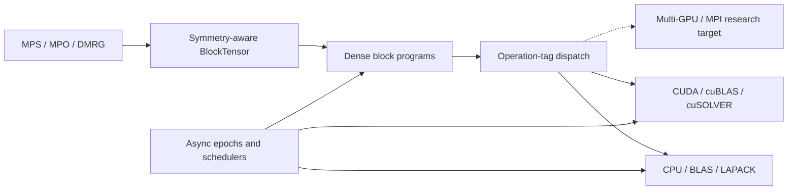

# Uni20

[](https://github.com/Uni20-dev/uni20/actions/workflows/ci.yml)
[](https://github.com/Uni20-dev/uni20/actions/workflows/docs.yml)
[](LICENSE)

**Symmetry-aware tensor networks for heterogeneous high-performance computing.**

Uni20 is an experimental C++23 platform for researching tensor-network
algorithms for quantum many-body simulation that retain their mathematical
structure as they move across CPUs, NVIDIA GPUs, and future distributed
systems. Its current end-to-end focus is the density matrix renormalization
group (DMRG): explicit quantum-number sectors at the algorithm layer, dense
block programs at the numerical layer, and asynchronous execution across the
machine underneath.

> [!IMPORTANT]
> Uni20 is an early-stage research project, not a stable released library.
> APIs and algorithms are evolving, backend coverage is operation-specific,
> and the code currently serves as an executable design and validation
> platform rather than a general-purpose tensor-network package.

## Research Thesis

Large tensor-network calculations are not simply dense linear algebra at a
larger scale. They combine irregular symmetry-defined block structure, many
small and medium dense kernels, evolving data placement, and global algorithmic
dependencies. Uni20 is designed around four consequences:

- **Symmetry is part of the tensor.** Quantum numbers, leg orientation, and
  legal block structure survive contraction, decomposition, truncation, CUDA
  lowering, and future communication. There is no implicit dense fallback for
  a symmetry-aware calculation.
- **Algorithms select work; backends execute it.** Tensor operations lower
  through inspectable operation-tag dispatch to CPU reference kernels,
  BLAS/LAPACK, CUDA kernels, cuBLAS, or cuSOLVER without giving provider APIs
  ownership of tensor semantics.
- **Asynchrony is a data-lifetime model.** `Async<T>`, epochs, and schedulers
  express causality and safe mutation across host and device work. CUDA events
  record backend completion; they do not create a second dependency system.
- **Placement must remain extensible.** Current host and single-GPU paths are
  stepping stones toward multi-GPU and MPI-distributed block placement, not
  assumptions embedded in the tensor interface.

## Working Today

Uni20 already contains several connected, tested vertical slices:

- fixed-rank dense `Tensor` values, `mdspec` metadata views, semantic mdspan
  accessors, generated tensors, structural views, reductions, contractions,
  decompositions, and matrix-free Krylov algorithms;
- ordered backend dispatch across CPU reference, BLAS, LAPACK, compiled CUDA,
  cuBLAS, and cuSOLVER implementations, with explicit runtime decline and no
  hidden host/device transfer;
- an epoch-ordered async runtime with debug and oneTBB schedulers, CUDA-aware
  scheduling, task diagnostics, and async wrappers over the dense operation
  surface;
- a bosonic Abelian U(1) `BlockTensor` model with typed domain/codomain spaces,
  sparse and complete block patterns, packed host and CUDA storage,
  structure-preserving contraction and linear operations, and staged
  per-charge-sector SVD and truncation;
- a finite open-chain spin-half Heisenberg calculation with a Neel product MPS,
  symmetry-aware MPO and environments, matrix-free fixed-work Lanczos, and
  alternating two-site DMRG sweeps on CPU or a single resident CUDA device;
- real and complex `float`/`double` paths across the supported host operations,
  plus selected binary128 validation and DMRG paths through MPLAPACK.

The resident-CUDA DMRG path keeps the MPS, environments, two-site centers,
Krylov vectors, and SVD factors on the selected GPU. Its measured CPU/CUDA
scaling studies are recorded as reproducible engineering baselines, not as
general hardware-performance claims.

## Architecture



Before backend selection, tensor views retain storage and execution policy.
After selection, fixed operands normalize to `mdspec` descriptors. The selected
backend acquires the appropriate host or CUDA lease and lowers to an mdspan,
provider call, or lower-level Uni20 kernel. Replaceable outputs remain at the
tensor layer until the backend can choose compatible shape and placement.

## Run the DMRG Vertical Slice

A supported C++23 compiler, CMake 3.24 or newer, and BLAS/LAPACK are required.
Compatible versions of oneTBB, fmt, GoogleTest, and Google Benchmark can be
fetched by CMake when they are not installed locally.

```bash
cmake -S . -B build -G Ninja -DCMAKE_BUILD_TYPE=Release
cmake --build build --target spin_half_heisenberg_dmrg_example
./build/examples/spin_half_heisenberg_dmrg_example --check
```

For a CUDA build with cuBLAS and cuSOLVER:

```bash
cmake -S . -B build-cuda -G Ninja \
  -DCMAKE_BUILD_TYPE=Release \
  -DUNI20_ENABLE_CUDA=ON \
  -DUNI20_BACKEND_CUBLAS=ON \
  -DUNI20_BACKEND_CUSOLVER=ON
cmake --build build-cuda --target spin_half_heisenberg_dmrg_example
./build-cuda/examples/spin_half_heisenberg_dmrg_example \
  --execution=cuda --cuda-device=0 --check
```

The current CUDA DMRG executable supports real double precision. See the
[model example guide](examples/models/) for larger fixtures, execution and
storage controls, reference energies, and benchmarking rules.

## Research Direction

The immediate research program is to make symmetry-aware DMRG efficient at
much larger bond dimensions and on heterogeneous systems. The main tracks are:

- scheduling and coalescing irregular block contractions for GPU efficiency;
- backend-aware contraction planning and reduced temporary materialization;
- multi-GPU block placement and MPI/NCCL communication without losing sector
  metadata or causal ordering;
- broader Abelian and non-Abelian symmetries, followed by tensor categories
  with non-trivial braiding;
- stronger single-site and two-site DMRG algorithms, measurements, and
  precision-aware numerical validation;
- focused Python interfaces once the underlying C++ contracts stabilize.

## Explore and Contribute

- [About Uni20](docs/about.md): current capabilities and design boundaries.
- [Getting Started](docs/getting_started.md): prerequisites, build options,
  CUDA initialization, testing, and developer tooling.
- [Architecture Overview](docs/architecture/overview.md): execution layers and
  ownership boundaries.
- [Tensor-Network Documentation](docs/tensor_network/): BlockTensor, DMRG,
  environment, SVD, and performance design.
- [DMRG Performance Baselines](docs/tensor_network/dmrg_performance_baselines.md):
  reproducible CPU/CUDA measurements and profiling conclusions.
- [Roadmap](docs/roadmap.md): active implementation tracks.
- [Contributing](docs/CONTRIBUTING.md): development, testing, and review
  expectations.

Uni20 is being developed as an open research platform. Collaboration is
especially welcome around GPU numerical kernels and scheduling, block-sparse
algorithms, multi-GPU and distributed execution, symmetry models, and
large-scale DMRG validation. Use
[GitHub issues](https://github.com/Uni20-dev/uni20/issues) for technical
proposals, reproducible problems, and research discussions.
