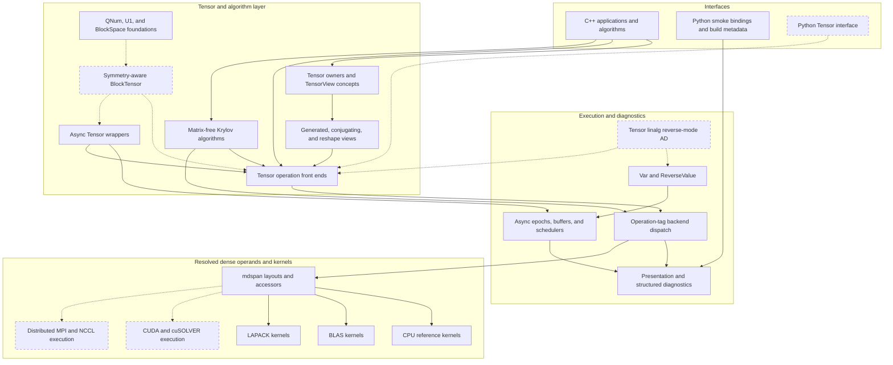

# Uni20 Architecture Overview

This diagram summarizes the current implementation and the main planned
extensions.

- **Solid nodes and edges:** implemented and exercised today.
- **Dashed nodes and edges:** foundations, stubs, or planned integration.



## Implemented Path

The central design property is that synchronous and asynchronous Tensor
operations share one kernel path:

```text
Tensor front end
  -> output shape, ownership, and storage policy
  -> backend selector
  -> resolved mdspan operands
  -> operation-tag dispatch
  -> CPU, BLAS, or LAPACK kernel
```

An Async wrapper enrolls epochs, schedules a coroutine, awaits stored Tensor
values, and then calls that same Tensor front end. Backends do not receive
`Async<T>` objects and leaf kernels do not receive Tensor ownership policy.

Krylov algorithms are matrix-free in application space. Their small dense
projected problems use `DenseMatrix` and the same linalg dispatch layer rather
than a private dense backend.

## Important Boundaries

- Tensor storage, views, and operation output policy are resolved before leaf
  kernels receive mdspans.
- Mdspan accessors carry value semantics. A pointer-shaped handle alone does not
  authorize direct BLAS/LAPACK access.
- Async owns causal ordering and lifetime. A future CUDA event or MPI request is
  completion evidence for an epoch, not a second ordering system.
- Symmetry-aware lowering must decide legal blocks and preserve quantum-number
  metadata before emitting dense block operations.
- Ordinary backend decline never transfers operands between host, device, or
  MPI domains.

## Current Maturity

- `DebugScheduler`, `TbbScheduler`, and `TbbNumaScheduler` are implemented.
- Async matrix products, Async self-adjoint `eigh`, owner-retaining conjugation,
  and owner-retaining reshape aliases are implemented.
- CPU reference, BLAS, and initial LAPACK dispatch paths are active.
- `Var<T>` and `ReverseValue<T>` provide async value-level reverse-mode
  foundations; Tensor linalg rules remain future work.
- Python currently exposes smoke functionality and build information rather
  than Tensor operations.
- CUDA/cuSOLVER, distributed execution, and the symmetry-aware `BlockTensor`
  remain incomplete.

See [About Uni20](about.md) for the capability overview and
[Roadmap](roadmap.md) for the implementation priorities.
